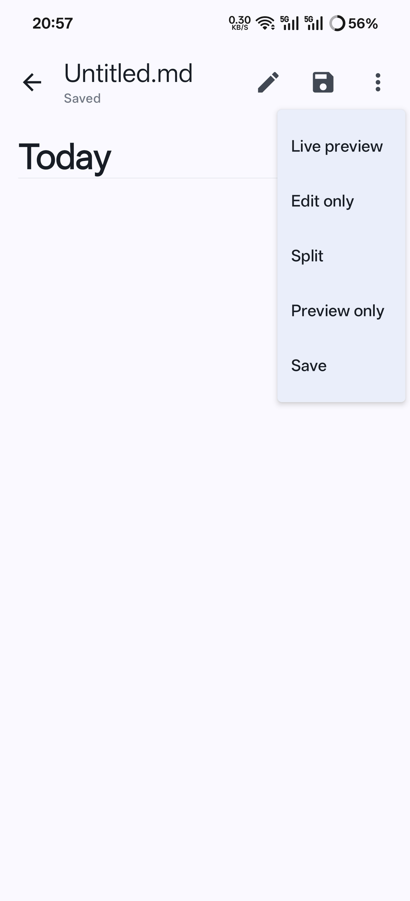
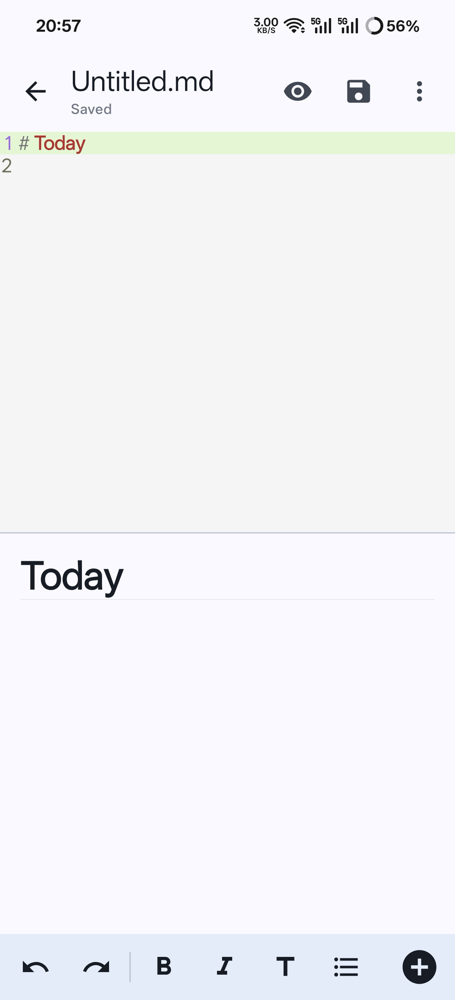
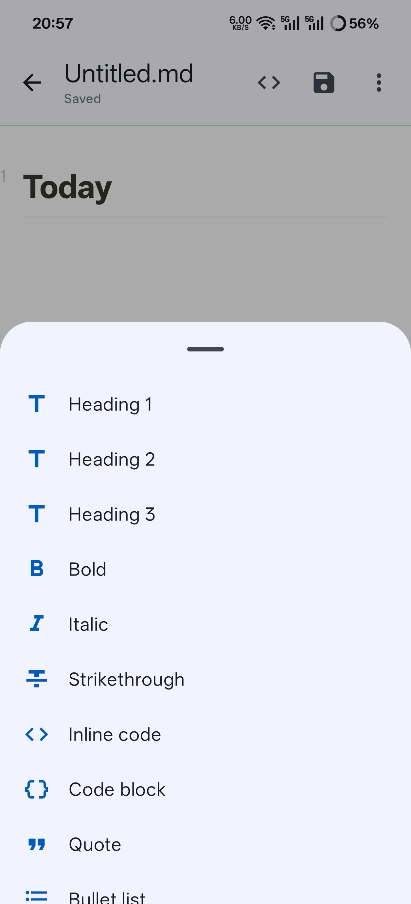
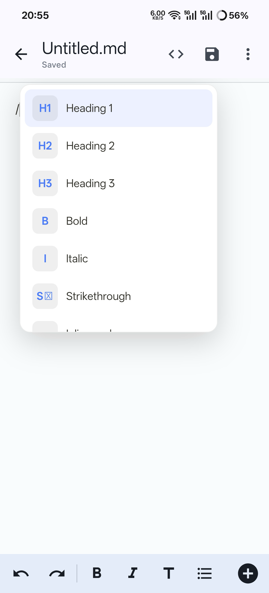
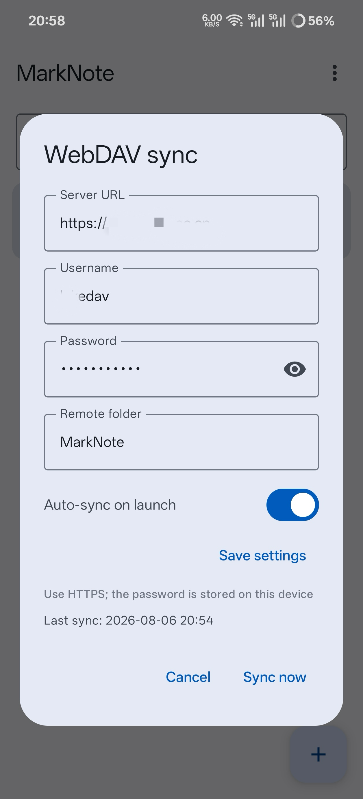

<div align="center">

# MarkNote (墨记)

**Ein eleganter Markdown-Editor mit Live-Vorschau für Android** — Notion-artige
WYSIWYG-Bearbeitung, Typora-artige Vorschau, lokale Dateien, WebDAV-Synchronisierung
und 6 integrierte Sprachen.

[English](README.md) · [中文](README_zh.md) · [Français](README_fr.md) ·
[**Deutsch**](README_de.md) · [日本語](README_ja.md) · [Español](README_es.md)


</div>

---

## Was ist MarkNote?

MarkNote ist ein mobil-orientiertes Markdown-Notizbuch. Statt roher Markdown-Syntax zeigt
es den Inhalt beim Tippen live gerendert — Überschriften, Fett, Listen, Bilder und
Codeblöcke werden sofort formatiert, wie bei Notion oder Typora.

Deine Notizen liegen in **echten `.md`-Dateien auf deinem Gerät** — ohne Lock-in. Du kannst
jederzeit zu einem Quellcode-Editor, einer geteilten Ansicht oder einer reinen
Schreibschutz-Vorschau wechseln. Die WebDAV-Synchronisierung hält denselben Ordner auf
deinen anderen Geräten und Servern verfügbar.

## Screenshots

> 📷 Die Screenshots pflegt der Projektinhaber. Lege eigene Bilder mit den Namen
> `live.png`, `split.png`, `preview.png`, `formatting.png` und `webdav.png` in
> [`docs/screenshots/`](docs/screenshots/) ab, damit die Tabelle unten sie anzeigt.
> Bitte nur Demo-Inhalte verwenden — keine echten Notizen, Serveradressen oder Zugangsdaten.

| Live-Bearbeitung | Geteilte Ansicht | Nur Vorschau |
| --- | --- | --- |
|  |  |  |

| Formatierungsmenü | WebDAV-Synchronisierung |
| --- | --- |
|  |  |

## Funktionen

- **Notion-artige Live-Bearbeitung** — `/` eingeben für Überschriften, Fett, Listen,
  Zitate, Tabellen, Bilder und mehr; Markdown-Markierungen werden ausgeblendet und in
  Echtzeit gerendert.
- **Typora-artige Vorschau** — geteilte Ansicht und Nur-Vorschau-Modus nativ gerendert,
  lokale Bilder inline angezeigt und automatisch als Blöcke angeordnet.
- **Lokale Dateien zuerst** — Notizen werden als echte `.md`-Dateien im Dokumentordner der
  App gespeichert; Bilder werden nach `Images/` kopiert und mit relativen Pfaden referenziert.
- **WebDAV-Bidirektionale Synchronisierung** — sichere Synchronisierung (keine versehentlichen
  Löschungen), Auto-Sync beim Start und Passwort-Anzeige/Umschalten.
- **6 Sprachen** — 简体中文, English, Français, Deutsch, 日本語, Español, einschließlich
  Editor-Kern, Schrägstrich-Menü und Platzhaltern.
- **Drei Bearbeitungsmodi** — Live-WYSIWYG, Quellcode-Editor mit Syntax-Hervorhebung und
  geteilte/Vorschau-Ansicht, mit erhaltenem Cursor und Undo-Verlauf.
- **Schöne kompakte Symbolleiste** — feste Leiste, die der Tastatur folgt, mit
  Überschriften-Auswahl und Listen-Auswahl (Aufzählung/Nummerierung).

## Download

Der neueste APK wird mit jedem Release veröffentlicht:

- [**MarkNote-1.0.5.apk**](releases/MarkNote-1.0.5.apk) (auch an der
  [GitHub Release](https://github.com/Ninewansen/MarkNote/releases) angehängt)

Direkt auf Android 8.0+ (API 26+) installierbar. Keine Google-Play-Dienste erforderlich.

## Aus dem Quellcode bauen

Voraussetzungen:

- Android Studio (oder Android SDK + JDK 17)
- Android SDK Platform 36

```bash
git clone git@github.com:Ninewansen/MarkNote.git
cd MarkNote
./gradlew :app:assembleDebug
```

Die Release-Signatur wird aus `keystore.properties` im Projektstamm gelesen
(**nicht eingecheckt**). Für einen signierten Release-APK diese Datei lokal anlegen:

```properties
storeFile=keystore/marknote.keystore
storePassword=dein-store-passwort
keyAlias=dein-alias
keyPassword=dein-key-passwort
```

Ohne sie erzeugt `assembleRelease` einen unsignierten APK. Keystore niemals einchecken.

## WebDAV-Synchronisierung

1. App-Menü öffnen → **WebDAV-Synchronisierung**.
2. **Server-URL** (vollständige `https://…`-Adresse), **Benutzername** und **Passwort**
   eintragen.
3. **Jetzt synchronisieren** antippen (oder **Beim Start automatisch synchronisieren**
   aktivieren).

Die Synchronisierung ist sicher konzipiert: fehlende Dateien werden kopiert, geänderte
Dateien hoch-/heruntergeladen, und es wird nie automatisch gelöscht.

## Lokalisierung

| Sprache | Code | README | Status |
| --- | --- | --- | --- |
| 简体中文 | `zh` | [README_zh.md](README_zh.md) | ✅ |
| English | `en` | [README.md](README.md) | ✅ |
| Français | `fr` | [README_fr.md](README_fr.md) | ✅ |
| Deutsch | `de` | [README_de.md](README_de.md) | ✅ |
| 日本語 | `ja` | [README_ja.md](README_ja.md) | ✅ |
| Español | `es` | [README_es.md](README_es.md) | ✅ |

## Technologie-Stack

- **Kotlin + Jetpack Compose (Material 3)** — Oberfläche
- [**Vditor**](https://github.com/Vanessa219/vditor) — WYSIWYG-/Live-Rendering-Kern
- [**Markwon**](https://github.com/noties/Markwon) — natives Spannable-Rendering für die Vorschau
- [**Sora Editor**](https://github.com/Rosemoe/sora-editor) — Quellcode-Editor mit
  Syntax-Hervorhebung
- **OkHttp** — WebDAV-Client

## Datenschutz

- Alle Notizen und Bilder werden **lokal auf deinem Gerät** gespeichert.
- WebDAV-Zugangsdaten liegen in privaten App-Einstellungen und werden nur an den von dir
  konfigurierten Server gesendet. HTTPS verwenden.
- Keine Analysen, kein Tracking, keine Netzwerkaufrufe außer beim Synchronisieren.

## Lizenz

Veröffentlicht unter der [MIT-Lizenz](LICENSE).

## Danksagung

Danke an die Open-Source-Projekte, die MarkNote ermöglichen: Vditor, Markwon,
Sora Editor, Prism4j und OkHttp. Die Interaktionsgestaltung ist von Notion und Typora inspiriert.
